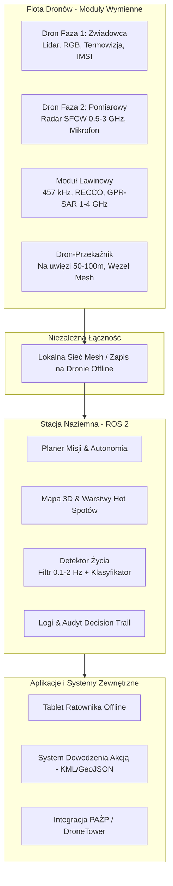

# 🚁 Rojowy System Dronów Ratowniczych z Radarem Life-Detection


> **Zaawansowany system SAR (Search and Rescue) łączący drony zwiadowcze, radary penetrujące podłoże (GPR/SFCW) oraz fuzję danych w celu automatycznego wykrywania osób żywych pod gruzowiskami i lawinami.**

---

## 📌 Zamysł i Pomysł (Executive Summary)

Podczas katastrof budowlanych (wybuchy gazu, trzęsienia ziemi) oraz schodzenia lawin, czas jest kluczowym czynnikiem decydującym o życiu. Klasyczne metody poszukiwań mają znaczne ograniczenia:
* **Termowizja i aparaty RGB** nie widzą pod powierzchnią gruzu/śniegu.
* **Ręczne systemy georadarowe/akustyczne (np. FINDER)** wymagają fizycznego wchodzenia ratowników na niestabilny, zagrażający życiu teren.
* **Pojedyncze drony z radarem w zawisie** zmagają się z zakłóceniami fali od własnych drgań i bardzo krótkim czasem pracy na baterii.

### 💡 Nasze rozwiązanie: Podział zadań według praw fizyki

Nasz system dzieli misję na dwie uzupełniające się fazy:

1. **Faza 1 (Szybki Zwiad Air-to-Ground):** Szybkie drony zwiadowcze (Lidar, RGB, Termowizja, detektory IMSI/telefonów) mapują teren w kilka minut. Tworzą **cyfrowego bliźniaka 3D**, typują potencjalne miejsca przebywania poszkodowanych (*hot spoty*) oraz bezpieczne miejsca lądowania.
2. **Faza 2 (Precyzyjny Pomiar Point-to-Point):** Drony pomiarowe **lądują bezpośrednio na gruzie** (lub opuszczają sondę na lince), wyłączają silniki i wykonują pomiar radarem SFCW (*Stepped-Frequency Continuous Wave*). Brak drgań od śmigieł eliminuje szumy, umożliwiając detekcję mikroruchów klatki piersiowej (oddechu) i tętna przez **1,5–3 metry gruzu**.

---

## 🏗️ Architektura Systemu

System bazuje na **ROS 2 (Robot Operating System)** oraz wspólnej warstwie danych. Wszystkie obserwacje z czujników trafiają do stacji naziemnej w czasie rzeczywistym.



---

## 🎯 Scenariusze Zastosowania

### 1. Gruzowiska (Wybuchy gazu, Katastrofy budowlane)
* **Obszar:** 0,1 – 10 ha | **Głębokość:** 0 – 5 m gruzu | **Okno czasowe:** Pierwsze 72h (okno USAR)
* **Przepływ działań:**
  1. **Rozstawienie (0–10 min):** Dron-przekaźnik wynosi węzeł sieci mesh na 50–100 m.
  2. **Zwiad Lidarem (5–15 min):** Tworzenie mapy 3D z dokładnością $\le 5\text{ cm}$. Wyznaczenie pustek oraz lądowisk (nachylenie $< 15^\circ$).
  3. **Pomiar w bezruchu (Faza 2):** Dron ląduje na gruzie, wyłącza silniki. Radar mierzy oddech przez 60–120 s. Równolegle trwa nasłuch akustyczny i generowanie komunikatów z głośnika.
  4. **Wielopunktowa Triangulacja:** Pozycja $x, y, z$ oraz głębokość określana jest z połączenia danych z 3–4 punktów pomiarowych wokół hot spotu.

### 2. Poszukiwania Lawinowe
* **Obszar:** 0,5 – 3 ha | **Głębokość:** 0,3 – 2 m śniegu | **Okienko przeżycia:** $< 15\text{ min}$
* **Przepływ działań:**
  1. **Przelot Szybki (20–30 m nad śniegiem):** Odbiornik detektorów lawinowych (457 kHz), system RECCO oraz Lifeseeker (wykrywanie telefonów).
  2. **Model Depozytu:** Lidar porównuje cyfrowy model terenu sprzed zimy z obecnym skanem, wskazując grubość śniegu.
  3. **Skanowanie GPR-SAR:** Niski przelot (2–4 m) z georadarem po trajektorii dopasowanej do profilu 3D śniegu.

---

## 📊 Szacunkowa Wydajność i Fizyka Systemu

### Wydajność Floty (Faza 2 na Gruzowisku)
Dzięki lądowaniu drony oszczędzają krytyczne zasoby energii:
* **Zawis przez 90 s (Dron 5 kg):** $\approx 22\text{ Wh}$ (ok. $6\%$ pojemności baterii)
* **Lądowanie na 90 s (Tylko radar + PC):** $\approx 0,5\text{ Wh}$

| Liczba Dronów Fazy 2 | Czas pomiaru na punkt | Przebadane Hot Spoty / godzinę |
| :--- | :--- | :--- |
| **1 dron** | 90 s | \~4.7 hot spotu/h |
| **3 drony** | 90 s | **\~14.2 hot spotu/h** |
| **6 dronów** | 90 s | \~28.4 hot spotu/h |

### Zasięg Radaru w Gruzie (Budżet Łącza)
Pomiar opóźnienia fali $t$ przy znanej przenikalności materiału $\varepsilon_r$ podaje głębokość $d$:

$$d = \frac{c \cdot t}{2\sqrt{\varepsilon_r}}$$

Lądowanie eliminuje zakłócenia fazowe echa powierzchniowego i szum rotorów, dodając **$+20\text{ dB}$ do budżetu łącza**:
* **W zawisie (3 m nad gruzem):** Wykrycie oddechu do $\sim 0,9\text{ m}$ w głąb.
* **Po wylądowaniu na gruzie:** Wykrycie oddechu do $\sim 1,8\text{ m}$ (przy tłumieniu $\alpha = 20\text{ dB/m}$).

---

## ⚖️ Aspekty Prawne i Baza Regulacyjna (PL / EU)

| Obszar | Status Prawny | Rozwiązanie w Projekcie |
| :--- | :--- | :--- |
| **Status Lotniczy (PSP / Policja)** | Lotnictwo Państwowe (wyłączone z unijnego Rozp. 2018/1139 art. 2). | Działania na procedurach wewnętrznych służb + szkolenia CNBOP wg kategorii szczególnej (SORA). |
| **Status Lotniczy (GOPR / TOPR)** | Cywilne przepisy EASA / ULC. | Kategoria Szczególna – scenariusze NSTS/SORA, teren akcji jako obszar kontrolowany. |
| **Użycie Georadaru (Radar Fazy 2)** | Urządzenia GPR/WPR wg UKE / ECC/DEC/(06)08 (30 MHz–12,4 GHz). | Zgodność z normą **ETSI EN 302 066**. Nadajnik włącza się **wyłącznie po kontakcie z podłożem**. |
| **Georadar z Powietrza (GPR-SAR)** | Praca nad ziemią ($>1\text{m}$) wymaga zgód radiowych. | Testowe pozwolenie radiowe UKE na dedykowane pasmo dla akcji SAR. |
| **Wykrywanie Telefonów (IMSI)** | Wymaga statusu stacji bazowej. | Integracja gotowych, certyfikowanych modułów (klasy NeoSoft SAR / Lifeseeker) na zgłoszeniu służb. |
| **RODO / Dane Osobowe** | Dane o lokalizacji i wizerunek to dane wrażliwe. | Podstawa: ochrona żywotnych interesów. Szyfrowanie, natychmiastowe hashowanie IMSI, usuwanie danych po akcji. |

---

## 💻 Zakres Dema na Hackathon (POC / MVP)

Ze względu na ograniczenia czasowe hackathonu, prezentujemy **działający prototyp w symulacji (ROS 2 + Gazebo)** z pełnym przepływem danych:

1. **Środowisko 3D (Gazebo):** Model gruzowiska 3D + Dron Fazy 1 mapujący obszar symulowanym Lidarem.
2. **Generowanie Hot Spotów:** Przetworzenie chmury punktów w ROS 2, wyznaczenie bezpiecznych lądowisk i stref przebywania ludzi.
3. **Syntetyczny Radar i Detekcja:** Autorski moduł przetwarzania sygnału radaru w Python/C++:
   * Filtracja pasmowa ($0,1 – 2\text{ Hz}$).
   * Wykrywanie wzorców oddechowych ($0,2 – 0,3\text{ Hz}$) oraz tętna ($1 – 1,5\text{ Hz}$).
   * Odporność na szum środowiskowy i ruchy ratowników wokół.
4. **Interfejs Ratownika (Dashboard GUI):** Wizualizacja offline w czasie rzeczywistym z możliwością zatwierdzania trafień i eksportem do formatu `GeoJSON`/`KML`.

### Uruchomienie stacji naziemnej (aplikacja web)

Dane z symulacji Gazebo (sesja rejestratora z `manifest.json`) leżą w `dane_z_symulacji/` i są serwowane przez Vite pod `/sim-data/` (inny katalog: zmienna `SIM_DATA_DIR`).

```bash
npm install
npm run dev          # http://localhost:5173
npm test             # testy jednostkowe algorytmów na prawdziwych danych z symulacji (vitest)
APP_URL=http://localhost:5173/ npm run test:e2e   # pełny przepływ misji w Chrome headless
```

Przepływ: **Misja** → wyznacz obszar (wielokąt / prostokąt / LKP + promień albo „miejsce zdarzenia z symulacji”) i wysokość lotu → *Wyślij zwiadowcę* → dron leci nad **wybrany obszar** trasą pokrycia („kosiarka”, pas termowizji wg wysokości), a skan 3D (chmura punktów) narasta na mapie tam, gdzie dron już przeleciał → **Hot spoty**: potencjalne miejsca osób, każde z dwiema składowymi — termowizja (anomalia cieplna na mapie 3D) i mikrofon (dźwięk narastający przy zbliżaniu się drona) → *Wyślij radary*: lądowanie jak najbliżej hot spotu, na stromym gruzie sonda na lince (wariant T) → **Wykrycia**: osoba, pozycja 3D, przedział głębokości → zatwierdzenie przez ratownika i eksport GeoJSON/KML. Zakładka **Scenariusz** steruje syntetycznym radarem fazy 2 (tłumienie gruzu, εr, zasypane osoby).

Dane czujników pochodzą z jednej sesji Gazebo; przy obszarze w innym miejscu scena jest zakotwiczona w środku narysowanego obszaru (dla obszaru obejmującego prawdziwe miejsce — georeferencja z GPS drona).

| Moduł | Co robi |
|---|---|
| `src/sim/flightPlan.ts` | trasa pokrycia wielokąta, szerokość pasa z pola widzenia termowizji (60°), czas zeskanowania każdego fragmentu terenu |
| `src/sim/rgbd.ts` | rozdzielenie czujników: chmura kamery RGB-D odtwarzana z map głębi + klatek RGB (woksel 5 cm), punkty lidaru rozpoznawane po kolorze zapasowym (rampa wysokości) — na mapie i w podglądzie 3D można pokazać lidar, RGB-D albo oba |
| `src/sim/thermal.ts` | rzutuje piksele termowizji promieniami na mapę wokselową z lidaru → tekstura temperatur i klastry ciepła |
| `src/sim/acoustic.ts` | STFT mikrofonu, usunięcie linii wirników, detekcja tonu / głosu / stuków, zgrubna lokalizacja (model 1/r) |
| `src/sim/fusion.ts` | hot spot = termowizja + mikrofon (korelacja głośności z bliskością drona), poziom ufności i uzasadnienie |
| `src/sim/landing.ts` | punkty pomiaru: lądowiska (nachylenie < 15°, płaskie ≥ 1,25 m) najpierw do 2,5 m, potem sonda na lince do 2 m, dalej do 5 m |
| `src/sim/radar.ts`, `radarFusion.ts`, `multilateration.ts` | syntetyczny SFCW (budżet łącza B = 81,5 dB, zasięg ~3 m przy 10 dB/m), detektor oddechu/tętna, grupowanie detekcji w osoby, pozycja 3D z nieznaną εr |
| `src/features/map/scanLayer.ts` | chmura punktów 3D na mapie (warstwa MapLibre + three.js), odsłaniana w trakcie lotu |
| `src/engine/engine.ts` | zegar misji i drony (start → przelot → lądowanie / sonda → pomiar → powrót / wymiana baterii) |

---|---|
| `src/sim/thermal.ts` | rzutuje piksele termowizji promieniami na mapę wokselową z lidaru → tekstura temperatur i klastry 37 °C / ogień |
| `src/sim/acoustic.ts` | STFT mikrofonu, usunięcie linii wirników, detekcja tonu / głosu / trzasków, zgrubna lokalizacja (model 1/r) |
| `src/sim/fusion.ts` | hot spoty z poziomem ufności i uzasadnieniem, strefa bazy, ogień jako zagrożenie |
| `src/sim/landing.ts` | lądowiska: nachylenie < 15°, płaskie ≥ 1,25 m, bez przeszkód dla śmigieł, 1–5 m od hot spotu |
| `src/sim/radar.ts`, `radarFusion.ts`, `multilateration.ts` | syntetyczny SFCW (budżet łącza B = 81,5 dB), detektor oddechu/tętna, grupowanie detekcji w osoby, pozycja 3D z nieznaną εr |
| `src/engine/engine.ts` | zegar misji i drony (start → przelot → lądowanie → pomiar → powrót / wymiana baterii) |

---

## 📚 Źródła i Bibliografia

1. **NASA Spinoff: FINDER** – [Finding Individuals for Disaster and Emergency Response](https://spinoff.nasa.gov/spinoff/spinoff_site/2015_FINDER.html)
2. **Grathwohl et al. (Uniwersytet w Ulm, 2021)** – [*Detection of Avalanche Victims using an Airborne GPR-SAR*](https://ieeexplore.ieee.org/document/9546252)
3. **Rong et al.** – [*Non-Contact Vital Signs Detection with UAV-Borne Radars*](https://www.mdpi.com/1424-8220/21/18/6034)
4. **NIST (National Institute of Standards and Technology)** – [*Building Materials Attenuation and Dielectric Properties at Microwave Frequencies*](https://www.nist.gov/publications/electromagnetic-properties-building-materials-30-mhz-10-ghz)
5. **UKE / Akty Prawne PL** – [*Rozporządzenie ws. urządzeń radiowych nadających bez pozwolenia (GPR/WPR EN 302 066)*](https://isap.sejm.gov.pl/isap.nsf/DocDetails.xsp?id=WDU20220002446)
6. **EASA / ULC** – [*Wytyczne dla lotów UAV w kategorii szczególnej (SORA / NSTS)*](https://www.ulc.gov.pl/pl/drony)
7. **Centum RT** – [*Lifeseeker Airborne SAR System for Mobile Phone Search*](https://centum-rt.com/lifeseeker/)
